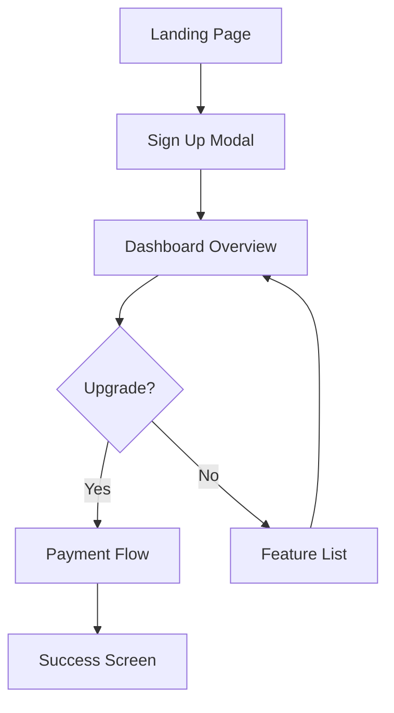

## Overview

Nicelydone equips you with powerful tools to discover design inspiration from over 178,400 screens and 7,900 user flows across top SaaS applications. You browse high-fidelity examples from real products like Notion, Linear, and Figma, filtered precisely to match your needs. Save favorites into custom collections to streamline your workflow and spark creativity efficiently.

<Columns cols={2}>
  <Card title="Screen Library" icon="image" href="#screen-library">
    Access thousands of UI screens categorized by component and app.
  </Card>
  <Card title="User Flows" icon="git-branch" href="#user-flows">
    Visualize complete navigation paths from real apps.
  </Card>
  <Card title="Filtering" icon="filter" href="#filtering">
    Narrow results by category, framework, or popularity.
  </Card>
  <Card title="Collections" icon="folder" href="#collections">
    Organize and share your saved inspirations.
  </Card>
</Columns>

## Screen Library

Dive into Nicelydone's vast library of screen examples sourced from leading SaaS products. Each entry shows full-context screenshots with interactive hotspots linking to related flows. You find precise matches for dashboards, modals, tables, and more.

<Callout kind="tip">
  Hover over any screen to reveal annotations on interactive elements, helping you understand UX decisions quickly.
</Callout>

Use the search bar to query specific patterns like `onboarding flow` or `pricing table`. Results load instantly with thumbnails for rapid scanning.

## User Flows

User flow diagrams map complete journeys across apps, from login to checkout. You trace navigation paths, decision points, and component transitions visually.

These diagrams include timestamps from real usage data, showing average time per step.

## Filtering Options

Tailor your search with advanced filters to focus on relevant examples.

<Tabs>
  <Tab title="By Category" icon="tag">
    Select from 50+ categories like `Analytics`, `Forms`, or `Settings`.
    
    | Category      | Example Apps       | Screen Count |
    |---------------|--------------------|--------------|
    | Dashboards    | Notion, Linear    | 12,500+     |
    | Onboarding    | Slack, Intercom   | 8,200+      |
    | Pricing       | Stripe, Vercel    | 4,100+      |
  </Tab>
  <Tab title="By Framework" icon="code">
    Filter by tech stack: `React`, `Vue`, `Tailwind CSS`.
    
    Quickly identify modern implementations matching your stack.
  </Tab>
  <Tab title="By Popularity" icon="trending-up">
    Sort by `Most Saved`, `Recently Added`, or `Top Rated`.
    
    Prioritize proven designs used by high-growth teams.
  </Tab>
</Tabs>

## Saving and Organizing Inspirations

Build personal collections to reference later. Follow these steps to get started:

<Steps>
  <Step title="Browse and Select" icon="search">
    Navigate to a screen or flow that inspires you.
    
    Click the heart icon to save it instantly.
  </Step>
  <Step title="Create Collection" icon="plus">
    Go to your dashboard and select `New Collection`.
    
    Name it descriptively, like `Dashboard Patterns`.
  </Step>
  <Step title="Organize and Tag" icon="tag">
    Drag saved items into collections.
    
    Add tags such as `mobile-first` or `dark-mode`.
  </Step>
  <Step title="Share or Export" icon="share">
    Generate shareable links or export as PDF for team reviews.
  </Step>
</Steps>

<Expandable title="Advanced Organization Tips" default-open="false">
  Use nested collections for hierarchical organization, like `E-commerce > Checkout Flows`. Integrate with tools like Figma via public links for seamless workflow.
</Expandable>

<Callout kind="success">
  Collections sync across devices, so your inspirations stay accessible wherever you design.
</Callout>